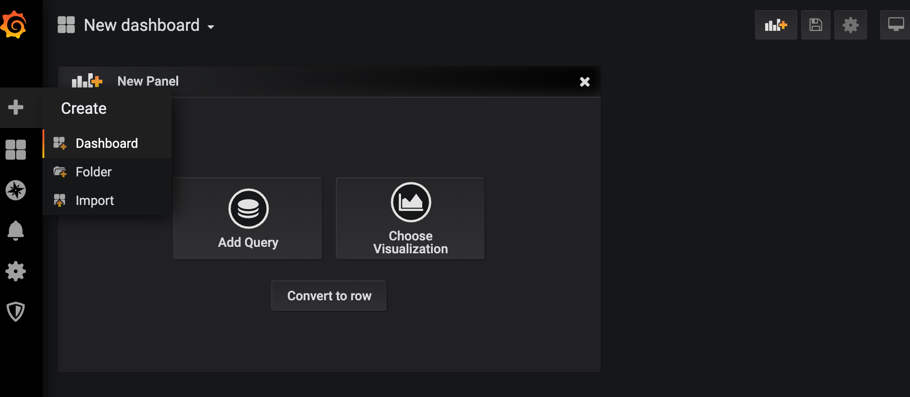
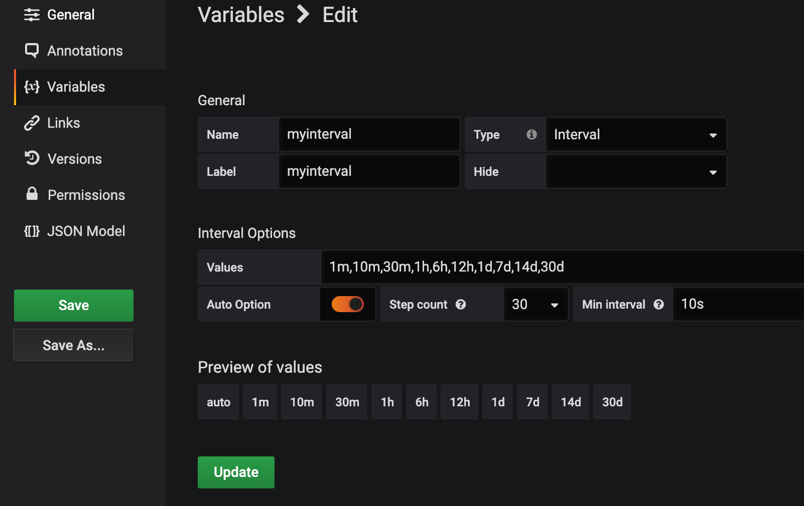
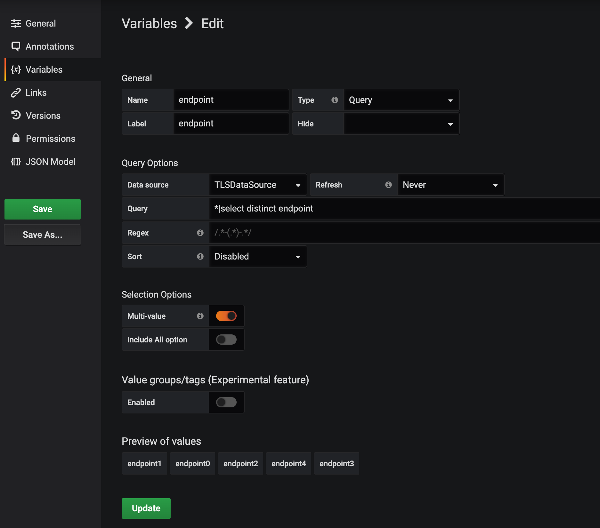
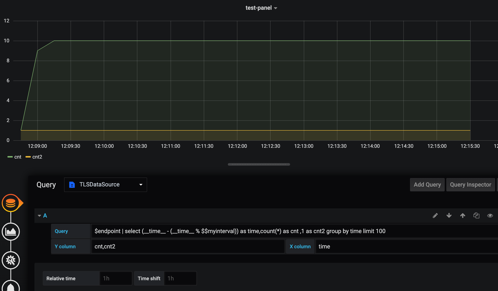
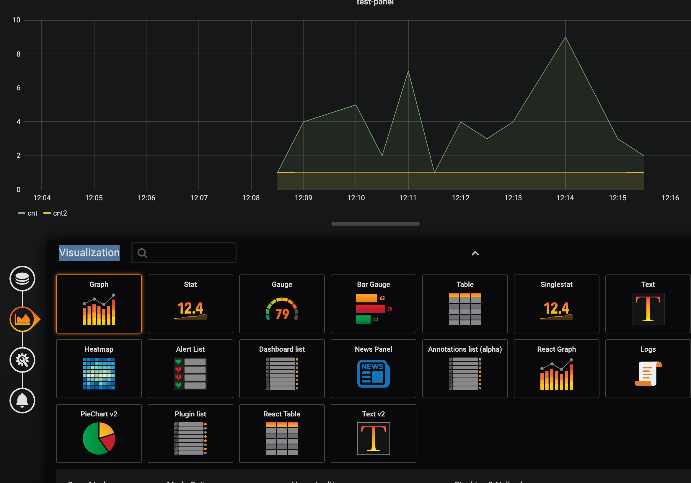
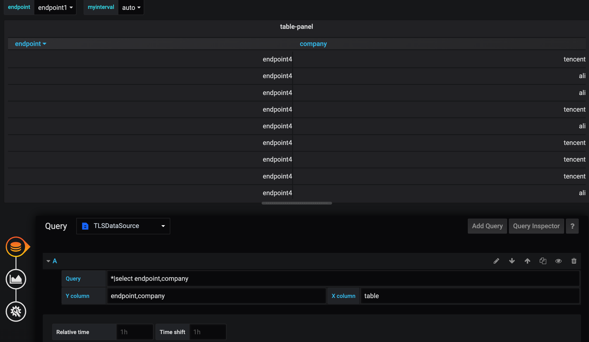
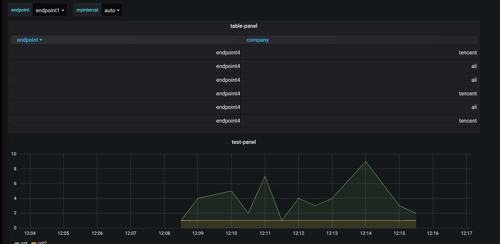

## 火山引擎日志服务数据源
## 开发
1. 下载代码后在根目录执行
```
yarn install
```
2. 编译
```
npm run build --force
```
## 安装


1. 克隆本项目或者下载代码压缩包到grafana插件目录下 , 然后重启grafana

* 使用RPM或者YUM安装的Grafana  
插件目录是 /usr/lib/grafana/plugins：
```
unzip tls-grafana-datasource-main.zip -d /var/lib/grafana/plugins
```
* 使用.tar.gz文件安装的Grafana  
插件目录是 {PATH_TO}/grafana-6.6.0/data/plugins：
```
unzip tls-grafana-datasource-main.zip -d {PATH_TO}/grafana-6.6.0/data/plugins
```
2. Grafana>=7.x(6.x及以下版本不需要)配置权限，允许加载未签名的Grafana插件。
* 使用RPM或者YUM安装的Grafana  
配置文件路径为:/etc/grafana/grafana.ini
* 使用.tar.gz文件安装的Grafana  
配置文件路径为:{PATH_TO}/grafana-6.6.0/conf/defaults.ini

设置
```
allow_loading_unsigned_plugins = tls-grafana-datasource
```
3. 重启Grafana
* 使用RPM或者YUM安装的Grafana:
```
systemctl restart grafana-server
```
* 使用.tar.gz文件安装的Grafana:
```
./bin/grafana-server
```
## 使用
目前TLS的Grafana插件支持时间序列图和表格两种形式的图表。
1. 时间序列图既是随着时间变化的指标图标，包含饼图、折线图、柱状图。
2. 表格则是明细日志的查看。
### 添加数据源

1. 在数据源管理面板, 添加 LogService 数据源

2. 在 settings 面板, 设置 Url 为您日志服务endpoint,例如： https://tls-cn-beijing.volces.com
，Access 设置为 Server(Default)

3. 设置 Region、Topic参数,以及账号的AccessKeyId
,设置 AccessId 和 AccessKeySecret。

4. 设置完成后，点击保存可以测试数据源是否可以访问。

### 添加Dashboard
1. 在页创建Dashboard。

2. 单击Dashboard右上角的设置，添加变量。

* 添加时间变量，Name为myinterval,Type选择Interval，选择Auto Option。
  

* 除了Grafana支持的变量类型，TLS支持了从Topic动态获取数据，在下拉菜单进行筛选。例如日志内容中有endpoint字段，图表可以根据endpoint的选择值动态变化。变量配置如下图所示：
  Name为endpoint,Type选择Query。Data source选择刚才添加的数据源，Query输入
```
*|select distinct endpoint
```
可以开启多选Multi-value。

## 添加图表
### 时间序列图表
1. 添加一个Panel, 在 datasource 选项, 选择刚创建的日志服务数据源。左上角的下拉菜单对应刚才添加的时间间隔和endpoint，用于查询结果的筛选。

2. 在 query 输入查询语句, 查询语法与日志服务控制台相同.

```
$endpoint | select (__time__ - (__time__ % $$myinterval)) as time,count(*) as cnt ,1 as cnt2 group by time limit 100
```

3. X轴设置为`time` (**秒级时间戳**)

4. Y轴设置为`cnt,cnt2` (**多列用逗号分隔**)。
   
5. Visualization选项中图表类型可以选择，Graph、Pie、Stat、React Graph、HeatMap。
   
6. 配置图表的Title、Description等属性，保存即可。

### 表格图表
操作步骤与添加时间序列图表第2、3、5步略有差异，其他完全一致。
2. Query为字段检索。
```
*|select endpoint,company
```
3. X轴设置为`table`,Y轴即是图表的表头字段。
 
5. Visualization选项中图表类型选择表格Table。

最终结果如下图所示：

