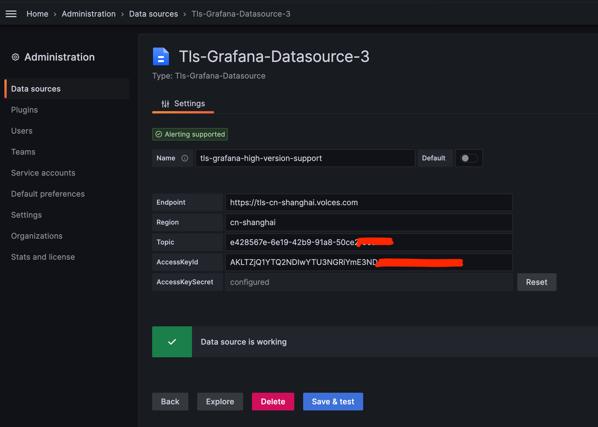
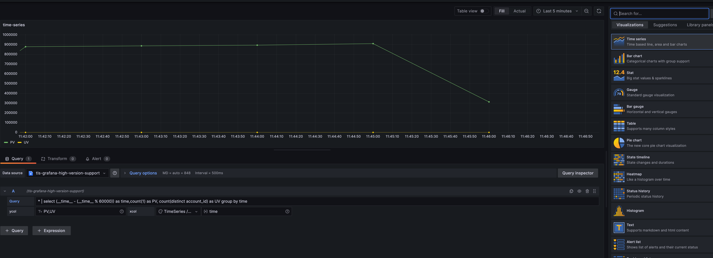
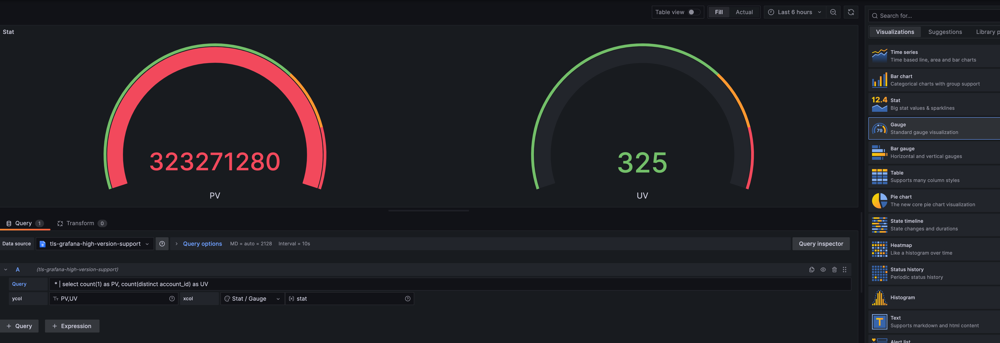
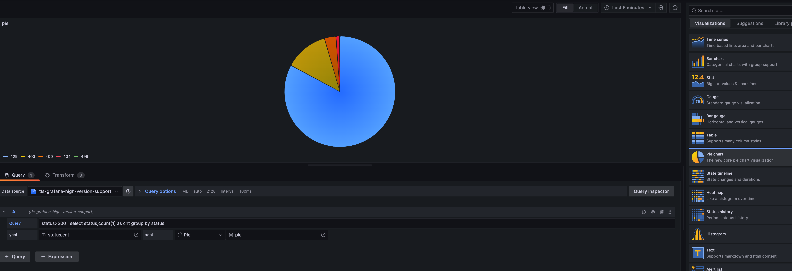
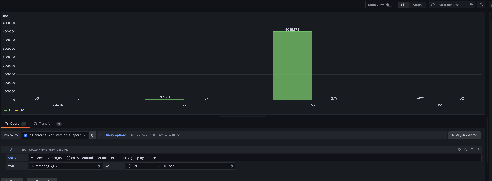
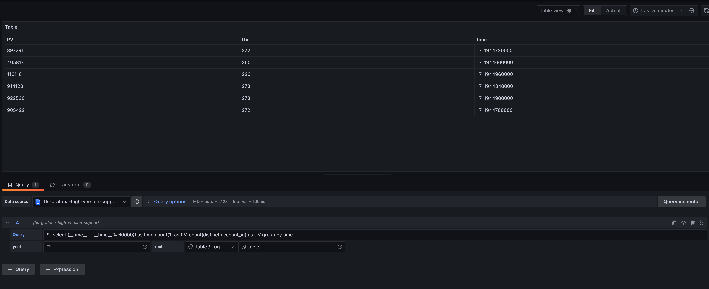

## 火山引擎日志服务数据源
## 安装

依赖 Grafana >= [9.x版本](https://codeload.github.com/volcengine/tls-grafana-datasource/zip/refs/heads/main) </br> 
Grafana 6.x~8.x版本请使用[1.0版本](https://codeload.github.com/volcengine/tls-grafana-datasource/zip/refs/tags/v1.2)
1. 克隆本项目或者下载代码压缩包到grafana插件目录下 , 然后重启grafana

* 使用RPM或者YUM安装的Grafana  
插件目录是 /usr/lib/grafana/plugins：
```
unzip tls-grafana-datasource-main.zip -d /var/lib/grafana/plugins
```
* 使用.tar.gz文件安装的Grafana  
插件目录是 {PATH_TO}/grafana-6.6.0/data/plugins：
```
unzip tls-grafana-datasource-main.zip -d {PATH_TO}/grafana-6.6.0/data/plugins
```
2. Grafana>=7.x(6.x及以下版本不需要)配置权限，允许加载未签名的Grafana插件。
* 使用RPM或者YUM安装的Grafana  
配置文件路径为:/etc/grafana/grafana.ini
* 使用.tar.gz文件安装的Grafana  
配置文件路径为:{PATH_TO}/grafana-6.6.0/conf/defaults.ini

设置
```
allow_loading_unsigned_plugins = tls-grafana-datasource
```
3. 重启Grafana。  
首先，kill终止Grafana进程。然后执行重启命令
* 使用RPM或者YUM安装的Grafana:
```
systemctl restart grafana-server
```
* 使用.tar.gz文件安装的Grafana:
```
./bin/grafana-server
```
## 使用
目前TLS的Grafana插件支持时间序列图、表格两种形式的图表。
1. 时间序列图既是随着时间变化的折线图。
2. 表格是明细日志的查看。
### 添加数据源

1. 在数据源管理面板, 添加 LogService 数据源

2. 在 settings 面板, 设置 URL 为您日志服务endpoint,例如： https://tls-cn-beijing.volces.com
，Access 设置为 Server(Default)

3. 设置 Region、Topic参数,以及账号的AccessKeyId
,设置 AccessId 和 AccessKeySecret。

4. 设置完成后，点击保存可以测试数据源是否可以访问。


## 添加图表
### 时间序列图表(TimeSeries)
配置参数
```
图表类型: Time
xcol: time
ycol: PV, UV
query: * | select (__time__ - (__time__ % 60000)) as time,count(1) as PV, count(distinct account_id) as UV group by time
```

如果想把一个维度爆炸为指标，可以配置为time,dimension，就可以把PV、UV指标增加为dimension_1_value*PV,dimension_1_value*UV...dimension_n_value*PV,dimension_n_value*UV，共2n个指标。目前折线数量限制2n<=100。
```
图表类型: Time
xcol: time,dimension
ycol: PV, UV
query: * | select (__time__ - (__time__ % 60000)) as time,count(1) as PV, count(distinct account_id) as UV group by time
```
### 单值图(Stat / Gauge)
配置参数
```
图表类型: Stat
xcol: stat
ycol: PV, UV
query: * | select count(1) as PV, count(distinct account_id) as UV
```


### 饼图(Pie)
配置参数
```
图表类型: Pie
xcol: Pie
ycol: status,cnt
query: status>200 | select status,count(*) cnt group by status
```


### 柱状图(Pie)
配置参数
```
图表类型: Bar
xcol: bar
ycol: method,PV,UV
query: * | select method,count(1) as PV,count(distinct account_id) as UV group by method
```

### 表格
配置参数
```
图表类型: Table
xcol: table
ycol: time,PV,UV
query: * | select (__time__ - (__time__ % 60000)) as time,count(1) as PV, count(distinct account_id) as UV group by time
```

